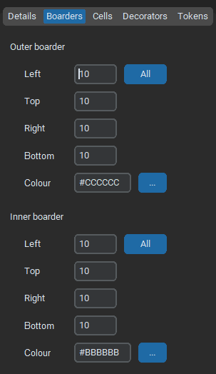
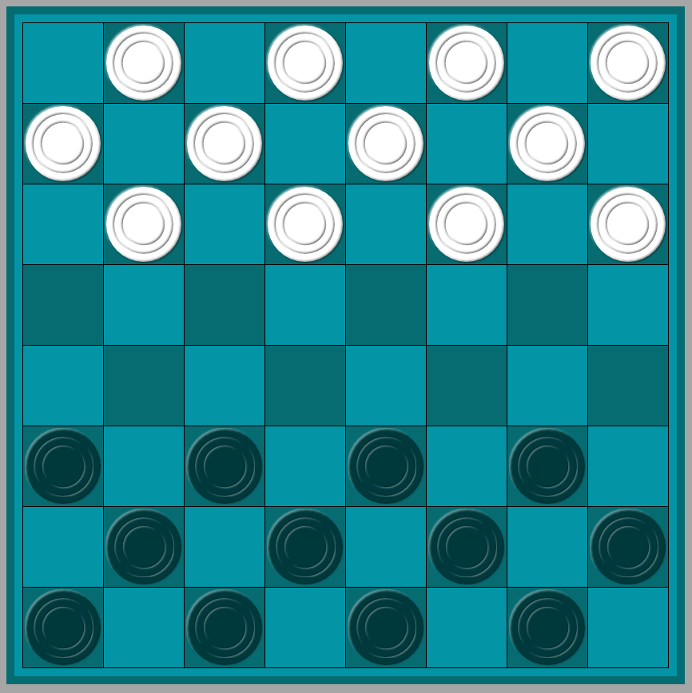

# gameboarddesigner
# A tool to create gameboards

Gameboard designer is a simple interface to facilitate the creation of 'tab' files for use with the 'gameboard' module (https://github.com/barrowcroft63/gameboard.git).

Gameboards can be created to a custom design and appropriate tokens added.

Installation:

The repository can be cloned using 'git clone https://github.com/barrowcroft63/gameboarddesigner.git'.

### Use

The gameboard designer provides a simple clean interface.

There are five tabs:

#### Details:

The details panels is where you record the basic details of the gameboard.

#### Boarders:

The boarders panel is where you specify the size and colour of the two boarders. There is an outer and inner boarder. The width of each edge of the boarder can be individually set. The outer and inner boarders can have different colours.

#### Cells:

The cells panel is where you specify the cells that make up the main part of the board. A board can be created with up to 50 cells horizontally, and 50 cells vertically. 

For each row of cells the height, top padding and bottom padding can be set along with the size of an horizontal gutter following the row.

For each column of cells the width, left padding and right padding can be set along with the size of a vertical gutter following the column,

The colour of the gutter between rows and columns can also be set.

When an individual cell is selected (by clicking on the gameboard) the colour of that cell and the colour of the cell padding can be set.

#### Decorators:

The decorators panel is where you add personality to you gameboard; there is the option to set light and dark colours and for a checkerboard design to be created.

Cell decorators can be provided; just select the cell (by clicking on the gameboard), and specify the 'png' file to use to decorate that cell. The image selected will be resized to the size of cell.

Board decorators can be provided. Click the 'add decorator' option to specify a new decorator file (png). This can then be postioned on the board as required. If a particular image has already been used it can be reused by selecting it from the option list. Board decorators are not resized.

#### Tokens

The tokens panel is where the games tokens are specified. By selecting the 'add token' option a 'png' file can be selected to use as a token. A name for the token should be provided. Tokens will be resized to fit the cell.

Once tokens have been specified they can be optionally placed on the board. Select the cell to place the token into (by clicking on the gameboard), then select the cell by name for the option list.

### Examples

Example boards created with gameboarddesigner.

### Checkers

### Reversi

### Royal Game of Ur

### Hnefatafl
